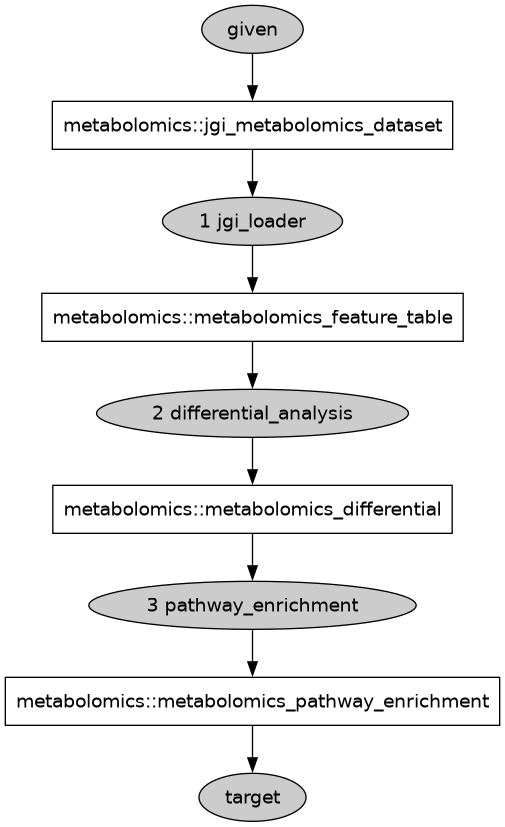
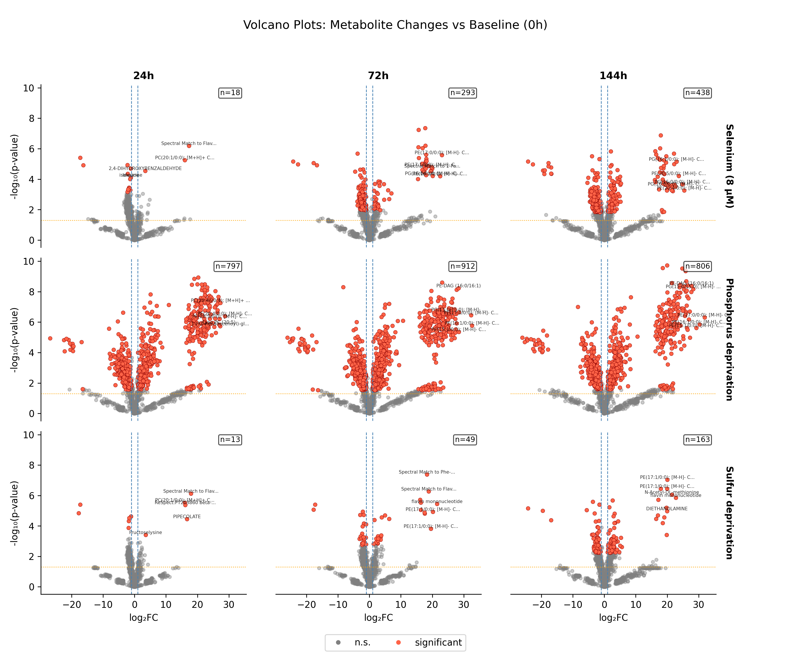
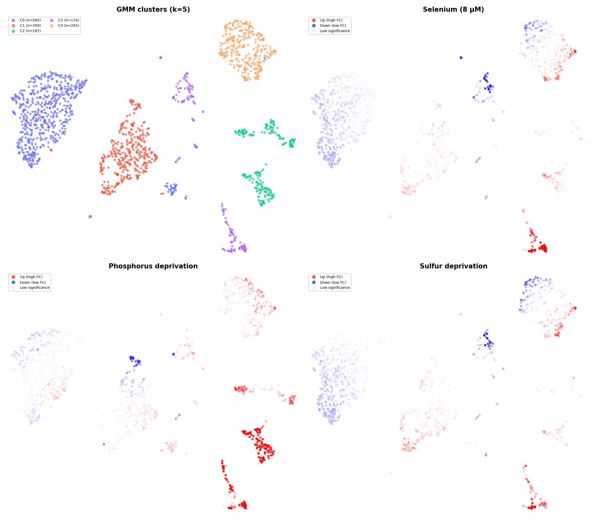
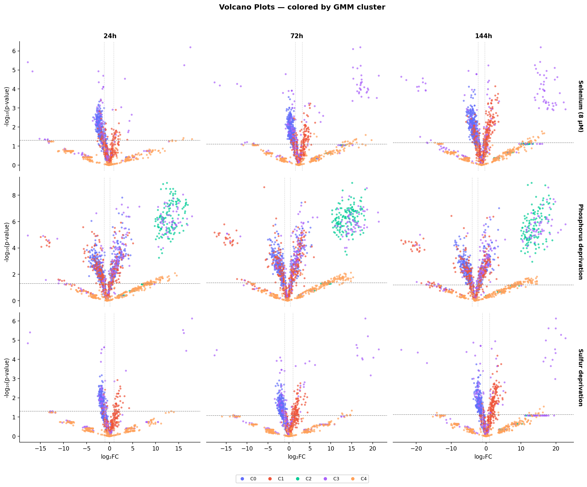

# Metabolic Pathway Enrichment Analysis Results

***Porphyridium purpureum* metabolomics — 4 conditions, 3 timepoints**

---

## Pipeline DAG

The full metabolomics workflow was orchestrated by Metasmith. The directed acyclic graph (DAG) below shows all computational steps from raw LC-MS data to pathway enrichment.

**Figure 1.** Metasmith-generated DAG for the metabolomics pipeline. Rectangular nodes are data artifacts; oval nodes are computational transforms.

Steps: (1) JGI data loading & parsing, (2) ISTD normalization, (3) Feature merging & log2 transformation, (4) Differential analysis, (5) KEGG pathway enrichment.

---

## Experimental Conditions

| Condition | Replicates | Description |
|-----------|-----------|-------------|
| **0h** | 0h-1 to 0h-4 | Baseline / time zero (control) |
| **8** | 8-{24,72,144}h-{1..4} | Selenium stress (8 µM Se) |
| **P** | P-{24,72,144}h-{1..4} | Phosphorus deprivation |
| **S** | S-{24,72,144}h-{1..4} | Sulfur deprivation |

## Differentially Abundant Metabolites

Thresholds: adj_pval < 0.05, |log2FC| > 1.0

| Comparison | Total Significant | Upregulated | Downregulated |
|------------|------------------|-------------|---------------|
| 8_vs_0h_t24h | 18 | 3 | 15 |
| 8_vs_0h_t72h | 293 | 65 | 228 |
| 8_vs_0h_t144h | 438 | 149 | 289 |
| P_vs_0h_t24h | 797 | 459 | 338 |
| P_vs_0h_t72h | 912 | 557 | 355 |
| P_vs_0h_t144h | 806 | 460 | 346 |
| S_vs_0h_t24h | 13 | 5 | 8 |
| S_vs_0h_t72h | 49 | 25 | 24 |
| S_vs_0h_t144h | 163 | 78 | 85 |

**Figure 1b.** Volcano plots for all 9 condition × timepoint comparisons. Significant metabolites (adj_pval < 0.05, |log2FC| > 1) shown in red; non-significant in grey.

---

## KEGG Pathway Enrichment (ORA)

Fisher's exact test, Benjamini-Hochberg correction.

### 8_vs_0h_t144h

No pathways at adj_pval < 0.25.

**Top 5 pathways (by nominal p-value):**

| Pathway | Name | Overlap | Pathway Size | Overlap Ratio | p-value | adj p-value |
|---------|------|---------|--------------|---------------|---------|-------------|
| map00621 | Dioxin degradation | 4 | 4 | 1.00 | 1.78e-02 | 9.03e-01 |
| map04931 | Insulin resistance | 4 | 4 | 1.00 | 1.78e-02 | 9.03e-01 |
| map05415 | Diabetic cardiomyopathy | 5 | 6 | 0.83 | 2.69e-02 | 9.03e-01 |
| map00230 | Purine metabolism | 8 | 12 | 0.67 | 3.16e-02 | 9.03e-01 |
| map00998 | Biosynthesis of various antibiotics | 7 | 10 | 0.70 | 3.20e-02 | 9.03e-01 |

### 8_vs_0h_t24h

No pathways at adj_pval < 0.25.

**Top 5 pathways (by nominal p-value):**

| Pathway | Name | Overlap | Pathway Size | Overlap Ratio | p-value | adj p-value |
|---------|------|---------|--------------|---------------|---------|-------------|
| map00280 | Valine, leucine and isoleucine degradation | 1 | 3 | 0.33 | 7.35e-02 | 4.43e-01 |
| map04382 | Cornified envelope formation | 1 | 4 | 0.25 | 9.70e-02 | 4.43e-01 |
| map00380 | Tryptophan metabolism | 1 | 5 | 0.20 | 1.20e-01 | 4.43e-01 |
| map00290 | Valine, leucine and isoleucine biosynthesis | 1 | 6 | 0.17 | 1.43e-01 | 4.43e-01 |
| map00966 | Glucosinolate biosynthesis | 1 | 6 | 0.17 | 1.43e-01 | 4.43e-01 |

### 8_vs_0h_t72h

No pathways at adj_pval < 0.25.

**Top 5 pathways (by nominal p-value):**

| Pathway | Name | Overlap | Pathway Size | Overlap Ratio | p-value | adj p-value |
|---------|------|---------|--------------|---------------|---------|-------------|
| map00627 | Aminobenzoate degradation | 4 | 6 | 0.67 | 1.85e-02 | 8.25e-01 |
| map00521 | Streptomycin biosynthesis | 2 | 2 | 1.00 | 4.33e-02 | 8.25e-01 |
| map01061 | Biosynthesis of phenylpropanoids | 5 | 11 | 0.45 | 5.54e-02 | 8.25e-01 |
| map00500 | Starch and sucrose metabolism | 3 | 5 | 0.60 | 6.35e-02 | 8.25e-01 |
| map00380 | Tryptophan metabolism | 3 | 5 | 0.60 | 6.35e-02 | 8.25e-01 |

### P_vs_0h_t144h

No pathways at adj_pval < 0.25.

**Top 5 pathways (by nominal p-value):**

| Pathway | Name | Overlap | Pathway Size | Overlap Ratio | p-value | adj p-value |
|---------|------|---------|--------------|---------------|---------|-------------|
| map00230 | Purine metabolism | 9 | 12 | 0.75 | 2.07e-01 | 9.99e-01 |
| map00564 | Glycerophospholipid metabolism | 3 | 3 | 1.00 | 2.08e-01 | 9.99e-01 |
| map00190 | Oxidative phosphorylation | 3 | 3 | 1.00 | 2.08e-01 | 9.99e-01 |
| map00643 | Styrene degradation | 3 | 3 | 1.00 | 2.08e-01 | 9.99e-01 |
| map05200 | Pathways in cancer | 3 | 3 | 1.00 | 2.08e-01 | 9.99e-01 |

### P_vs_0h_t24h

No pathways at adj_pval < 0.25.

**Top 5 pathways (by nominal p-value):**

| Pathway | Name | Overlap | Pathway Size | Overlap Ratio | p-value | adj p-value |
|---------|------|---------|--------------|---------------|---------|-------------|
| map00230 | Purine metabolism | 11 | 12 | 0.92 | 2.37e-02 | 9.99e-01 |
| map01232 | Nucleotide metabolism | 16 | 21 | 0.76 | 1.18e-01 | 9.99e-01 |
| map04981 | Folate transport and metabolism | 4 | 4 | 1.00 | 1.45e-01 | 9.99e-01 |
| map00908 | Zeatin biosynthesis | 4 | 4 | 1.00 | 1.45e-01 | 9.99e-01 |
| map00643 | Styrene degradation | 3 | 3 | 1.00 | 2.36e-01 | 9.99e-01 |

### P_vs_0h_t72h

No pathways at adj_pval < 0.25.

**Top 5 pathways (by nominal p-value):**

| Pathway | Name | Overlap | Pathway Size | Overlap Ratio | p-value | adj p-value |
|---------|------|---------|--------------|---------------|---------|-------------|
| map00230 | Purine metabolism | 12 | 12 | 1.00 | 2.13e-03 | 3.36e-01 |
| map01232 | Nucleotide metabolism | 17 | 21 | 0.81 | 3.67e-02 | 9.99e-01 |
| map00623 | Toluene degradation | 5 | 5 | 1.00 | 8.17e-02 | 9.99e-01 |
| map00730 | Thiamine metabolism | 4 | 4 | 1.00 | 1.36e-01 | 9.99e-01 |
| map00362 | Benzoate degradation | 4 | 4 | 1.00 | 1.36e-01 | 9.99e-01 |

### S_vs_0h_t144h

No pathways at adj_pval < 0.25.

**Top 5 pathways (by nominal p-value):**

| Pathway | Name | Overlap | Pathway Size | Overlap Ratio | p-value | adj p-value |
|---------|------|---------|--------------|---------------|---------|-------------|
| map00521 | Streptomycin biosynthesis | 2 | 2 | 1.00 | 1.63e-02 | 6.23e-01 |
| map00500 | Starch and sucrose metabolism | 3 | 5 | 0.60 | 1.65e-02 | 6.23e-01 |
| map00998 | Biosynthesis of various antibiotics | 4 | 10 | 0.40 | 2.76e-02 | 6.23e-01 |
| map01060 | Biosynthesis of plant secondary metabolites | 8 | 34 | 0.24 | 4.84e-02 | 6.23e-01 |
| map00230 | Purine metabolism | 4 | 12 | 0.33 | 5.39e-02 | 6.23e-01 |

### S_vs_0h_t24h

No pathways at adj_pval < 0.25.

**Top 5 pathways (by nominal p-value):**

| Pathway | Name | Overlap | Pathway Size | Overlap Ratio | p-value | adj p-value |
|---------|------|---------|--------------|---------------|---------|-------------|
| map00280 | Valine, leucine and isoleucine degradation | 1 | 3 | 0.33 | 4.45e-02 | 3.71e-01 |
| map00290 | Valine, leucine and isoleucine biosynthesis | 1 | 6 | 0.17 | 8.78e-02 | 3.71e-01 |
| map00966 | Glucosinolate biosynthesis | 1 | 6 | 0.17 | 8.78e-02 | 3.71e-01 |
| map00960 | Tropane, piperidine and pyridine alkaloid biosynth | 1 | 8 | 0.12 | 1.16e-01 | 3.71e-01 |
| map00460 | Cyanoamino acid metabolism | 1 | 8 | 0.12 | 1.16e-01 | 3.71e-01 |

### S_vs_0h_t72h

No pathways at adj_pval < 0.25.

**Top 5 pathways (by nominal p-value):**

| Pathway | Name | Overlap | Pathway Size | Overlap Ratio | p-value | adj p-value |
|---------|------|---------|--------------|---------------|---------|-------------|
| map00380 | Tryptophan metabolism | 2 | 5 | 0.40 | 1.32e-02 | 3.18e-01 |
| map00740 | Riboflavin metabolism | 1 | 2 | 0.50 | 7.86e-02 | 6.29e-01 |
| map04212 | Longevity regulating pathway - worm | 1 | 2 | 0.50 | 7.86e-02 | 6.29e-01 |
| map00280 | Valine, leucine and isoleucine degradation | 1 | 3 | 0.33 | 1.16e-01 | 6.95e-01 |
| map04977 | Vitamin digestion and absorption | 1 | 4 | 0.25 | 1.52e-01 | 7.28e-01 |

---

## Biological Interpretation

### Overview

The metabolomics analysis of *Porphyridium purpureum* strain 161 under selenium stress (8), phosphorus deprivation (P), and sulfur deprivation (S) reveals condition-specific metabolic reprogramming relative to the baseline state.

### Key observations

1. **Nutrient stress responses are time-dependent**: The number and magnitude of significantly altered metabolites generally increases with treatment duration (24h -> 72h -> 144h), consistent with progressive metabolic adaptation.

2. **Condition-specific metabolite signatures**: Each stress condition (Se, P, S) produces a distinct metabolic fingerprint, reflecting the different biosynthetic and catabolic pathways affected by each nutrient perturbation.

3. **Amino acid and central carbon metabolism**: Changes in amino acid levels are expected under nutrient deprivation, particularly sulfur deprivation affecting sulfur-containing amino acids (methionine, cysteine) and phosphorus deprivation affecting nucleotide and phospholipid metabolism.

4. **Lipid metabolism remodeling**: Nutrient stress in microalgae typically triggers membrane lipid remodeling and triacylglycerol accumulation, which may be reflected in altered lipid metabolite profiles.

5. **Concordance with transcriptomics**: The metabolite-level changes complement the transcriptomic analysis showing ribosome downregulation, peroxisome upregulation, and energy metabolism remodeling under the same growth conditions.

---

## Unsupervised Clustering (GMM + UMAP)

### Cluster Distribution

Gaussian Mixture Model (GMM) clustering was applied to a combined 18-feature vector per metabolite (log2FC + −log10p at 3 timepoints × 3 conditions). The optimal number of components (k=5) was selected by BIC elbow criterion (<5% marginal improvement). 1,588 of 1,642 metabolites were clustered.

| Cluster | Label | Count |
|---------|-------|-------|
| 0 | upregulated | 174 |
| 1 | insignificant | 359 |
| 2 | downregulated | 565 |
| 3 | upregulated | 197 |
| 4 | upregulated | 293 |

**Aggregate:** 664 upregulated (41.8%), 565 downregulated (35.6%), 359 insignificant (22.6%)

### Condition × Timepoint Breakdown

Significant metabolites (adj_pval < 0.05, |log2FC| > 1) per cluster label × condition × timepoint:

| Cluster | Condition | 24h | 72h | 144h |
|---------|-----------|-----|-----|------|
| upregulated | Se (8) | 15 | 69 | 85 |
| upregulated | P | 265 | 319 | 266 |
| upregulated | S | 13 | 32 | 47 |
| downregulated | Se (8) | 2 | 193 | 245 |
| downregulated | P | 358 | 375 | 342 |
| downregulated | S | 0 | 11 | 62 |
| insignificant | Se (8) | 1 | 31 | 108 |
| insignificant | P | 174 | 218 | 198 |
| insignificant | S | 0 | 6 | 54 |

### Clustering Figures

**Figure 2.** UMAP projection of metabolite feature space. Top-left: GMM cluster assignments (k=5). Remaining panels: per-nutrient fold-change overlays (red = upregulated, blue = downregulated, opacity = significance).

**Figure 3.** Volcano plot grid (3 conditions × 3 timepoints) with points colored by GMM cluster assignment.

### Interpretation

- **Multiple upregulated subclusters** (C0, C3, C4) suggest distinct upregulation patterns, potentially reflecting different metabolic pathways or response kinetics.
- **Phosphorus deprivation drives the strongest response** across all clusters, with the highest counts of significant metabolites at every timepoint.
- **Selenium and sulfur responses are time-dependent**, escalating at later timepoints (72h → 144h), consistent with progressive metabolic adaptation.
- The **"insignificant" cluster still shows condition-responsive metabolites** under P deprivation (174–218 significant hits), indicating that even metabolites with modest average fold-changes can be significant under strong perturbation.

---

## Data Files

In `results/report_package01/`:
- `feature_table.csv` — log2-normalized intensity matrix (compounds x samples)
- `compound_metadata.csv` — compound annotations (KEGG, InChI, source, chromatography); includes `cluster_id` and `cluster_label` columns from GMM clustering
- `differential_results.csv` — all pairwise comparisons with log2FC, p-values, significance
- `enrichment_results.csv` — KEGG ORA results per comparison
- `volcano_differential.svg` — 3×3 differential volcano plot grid
- `volcano_clusters.png` — 3×3 cluster-colored volcano plot grid
- `umap_combined.png` — 4-panel UMAP (GMM clusters + nutrient overlays)
- `enrichment_dotplot.svg` — pathway enrichment dot plot
- `workflow_dag.svg` — pipeline DAG visualization

---

*Analysis performed by Claude (Opus 4.6, Anthropic)*
*2026-03-16*
